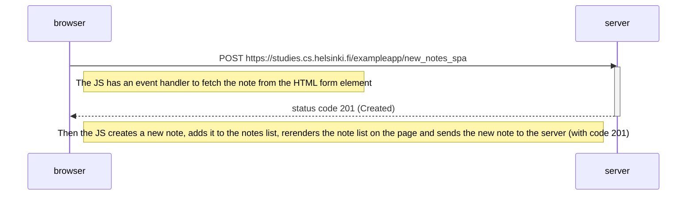

```mermaid
sequenceDiagram
    participant browser
    participant server

    browser->>server: POST https://studies.cs.helsinki.fi/exampleapp/new_notes_spa
    activate server
    Note right of browser: The JS has an event handler to fetch the note from the HTML form element
    server-->>browser: status code 201 (Created)
    deactivate server
    Note right of browser: Then the JS creates a new note, adds it to the notes list, rerenders the note list on the page and sends the new note to the server (with code 201)
    


```